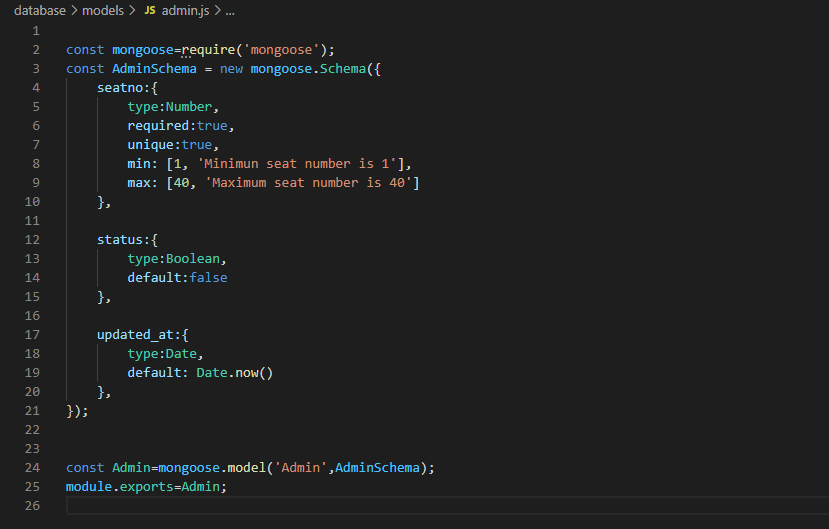
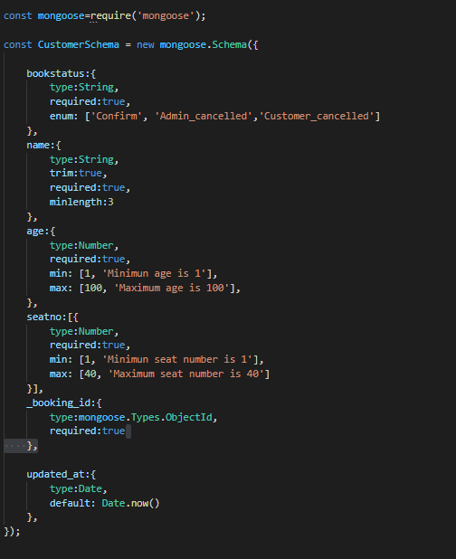

# BUS BOOKING API
This is a bus booking API in which customer can book tickets , cancel tickets and also get to know vacant seats in a bus.
Some requests can only be run by the admin, Reset tickets, update ticket, get all the tickets and get the closed tickets.

#INSTALLATION
Make sure you have Node , Postman and MongoDB Compass installed.
Once you download the "backend" folder , just run command "node app.js".
The server will start running.
Now you can test the API using POSTMAN.

# CUSTOMER AND ADMIN SCHEMAS

# THE CORE LOGIC

# ALL API REQUESTS EXPALINED 

# TECHNOLOGIES USED
MongoDB , NodeJs(Express)

# AUTHOR
Adish Aggarwal

